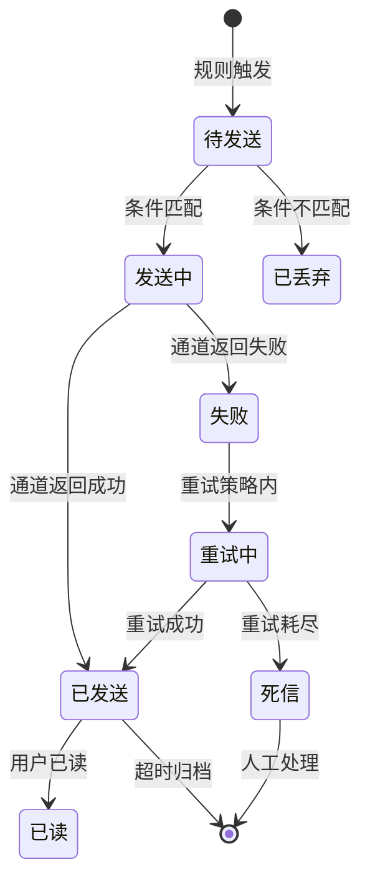

# 消息通知引擎 PRD

> **📌 复杂度：** 中等　|　标注 `[中等/复杂]` 的章节简单需求可大幅精简

---

## 一、问题与目标

### 背景与痛点

> **💡 业务背景：** 各业务线独立实现通知逻辑，每次新增通知类型都需前端+后端联动开发，严重拖慢业务响应速度。

**现状痛点：** 订单通知用邮件、告警通知用短信、活动通知用站内信，**每次新增通知类型需前后端各开发 3 天**，重复造轮子且风格不统一。

**业务价值：** 统一通知能力，新增通知类型从 **"前后端各开发 3 天"降为"配置 10 分钟"**。

### 目标与边界

> **📌 关键决策：** 构建通知规则引擎，业务方通过配置即可新增通知类型，无需代码开发。

**核心目标：**

1. 构建 **通知规则引擎**，支持触发/条件/动作三段式配置
2. 提供 **管理后台**，业务运营可自主配置通知规则
3. 接入 **邮件/短信/站内信** 三种发送通道

**做：**

- 通知规则引擎核心
- 规则管理后台
- 发送通道（邮件、短信、站内信）

**不做：**

- 消息模板编辑器（本期用预置模板）
- App Push 推送通道（留给下期）
- 用户通知偏好设置（留给下期）

### 取舍声明 `[中等/复杂]`

> **⚖️ 取舍声明：** 以下为战略级取舍，解释"做什么/不做什么"背后的决策逻辑

| 取舍 | 选择 | 放弃 | 何时重新审视 |
|------|------|------|------------|
| 灵活性 vs 上手速度 | 规则引擎 + 预置模板快捷入口 | 纯模板的零学习成本 | 配置完成时间中位数 > 30min |
| 覆盖度 vs 深度 | 三通道（邮件/短信/站内信） | 全通道覆盖（含 App Push/Webhook） | 业务方主动请求数 ≥ 3 个新通道 |
| 自动化 vs 可控性 | 规则触发自动发送，人工介入仅限死信 | 全自动含自动重发 | 死信队列人工处理率 > 10% |

### 场景泛化 `[中等/复杂]`

**定位：** 通用能力 — 通知引擎是跨业务线的基础设施

**扩展点预留：** 通道层设计为可插拔插槽，未来可扩展 App Push、Webhook、企业微信等通道

### 成功指标

> **✅ 验收重点：** 核心目标是"零代码新增通知类型"，以下指标直接衡量目标达成度

- [ ] **新增通知类型零代码占比 ≥ 80%**（配置上线，无需代码修改）
- [ ] **通知到达率 ≥ 99.5%**（Sent / (Pending - Discarded)）
- [ ] **从配置到上线 < 15 分钟**（端到端操作时间）

### 灵感碰撞记录 `[中等/复杂]`

> **⚡ 灵感来源：** 以下为灵感碰撞环节的产出记录

**纳入的灵感：**

| 灵感 | 价值 | 判定理由 |
|------|------|----------|
| 规则配置后自动用历史数据模拟触发次数 | 配置者在上线前就能验证规则是否合理，避免"上线才发现每秒触发一次" | 纳入：以最小代价（跑一遍最近 7 天的事件流）解决最大的配置风险，实现成本可控 |

**搁置的灵感：**

| 灵感 | 搁置原因 | 何时重新审视 |
|------|----------|------------|
| 通知频率限制（同一用户每小时最多 N 条） | 价值明确但本期范围不含用户偏好，频率限制需要与偏好联动才有意义 | 业务方反馈通知轰炸投诉 ≥ 3 次 |

---

## 二、架构与规则

### 核心业务对象

| 对象 | 定义 | 关键属性 |
|------|------|----------|
| 通知规则 | 一条通知规则，描述"什么事件→满足什么条件→发送什么通知" | 触发、条件、动作三段配置 |
| Notification | 一条已触发的通知实例，有独立生命周期 | 状态、通道、接收人、时间戳 |

### 状态流转 `[中等/复杂]`

*每个状态都有明确的进入条件和退出路径。*

### 规则编排

> **💡 设计思路：** 将通知逻辑抽象为 IFTTT（若甲则乙）模型，触发/条件/动作三段分别独立配置，避免每次新增通知类型需要硬编码。

**核心规则：**

| 维度 | 说明 |
|------|------|
| 触发 | 事件类型（`order.created` / `alert.triggered` / `campaign.started`）+ 事件 payload 字段 |
| 条件 | 事件字段匹配规则（且/或组合），如：`severity IN [P0,P1] AND region = "cn-east"` |
| 动作 | 通道选择（email/sms/in_app）+ 模板 ID + 接收人规则（角色/用户组/动态解析） |

*（⚠️ 警惕硬编码枚举 — 通道类型应设计为可插拔插槽，非穷举 if-else）*

**边界场景：**

- 条件不匹配 → 通知静默丢弃，不通知用户，日志可查
- 通道故障 → 自动重试，重试耗尽入死信队列，运维在后台可见
- 重复事件 → 幂等处理，同一事件 + 同一规则不重复触发
- 通知内容超长 → 截断并追加"查看详情"链接，保证通道兼容性
- 规则配置权限不足 → 拒绝操作，提示"需要XX角色权限"

### 非功能约束

> **🔴 约束：** 以下为系统必须满足的底线要求

| 维度 | 要求 | 量化阈值 |
|------|------|----------|
| 性能 | 单条通知从触发到发出延迟可控 | **P99 < 3s** |
| 容量 | 支持业务高峰并发 | **10,000 条/分钟** |
| 可靠性 | 发送失败需有兜底机制 | **至少 1 次重试，失败入死信队列** |
| 安全 | 通知内容数据传输安全 | **通道层加密传输** |

---

## 三、执行契约

### 用户故事

**主路径：**

- 作为 **业务运营** ，我希望 **在管理后台配置一条"当 P0 告警触发时，短信通知值班运维"的规则** ，以便 **不需要找开发就能快速响应紧急告警**

**异常分支：**

- 作为 **业务运营** ，当 **配置的条件语法错误时** ，我期望 **实时标红提示，不阻塞保存**
- 作为 **运维** ，当 **通道发送失败且重试耗尽时** ，我期望 **在后台死信队列中看到失败通知，可手动重发**

### 界面交互 `[中等/复杂]`

> **📌 说明：** 描述管理后台核心操作流程

**黄金流程：**

1. 进入规则列表页 → 查看已有规则
2. 点击"新建规则" → 进入三步配置向导
3. **Step 1 选择触发** → 从事件类型列表选择，预览事件 payload 字段
4. **Step 2 编辑条件** → 可视化条件编辑器，支持且/或组合
5. **Step 3 配置动作** → 选择通道、模板、接收人规则
6. 保存上线 → 规则立即生效

**异常响应：**

- 条件语法错误 → **实时标红，错误信息具体到字段**，不阻塞保存
- 保存失败 → **明确提示失败原因**，保留已填内容不丢失

### 全状态覆盖 `[中等/复杂]`

> **📌 说明：** 管理后台核心操作的五态覆盖

| 操作 | 正常态 | 等待态 | 空态 | 错误区 | 边界区 |
|------|--------|--------|------|--------|--------|
| 配置规则 | 三步向导完成配置 | 提交时 loading 按钮禁用 | — | 语法错误实时标红，保存失败提示原因 | 条件表达式超长时编辑器自适应 |
| 查看规则列表 | 展示规则卡片列表 | 骨架屏加载 | "暂无规则，点击新建"引导空态 | 加载失败提示"刷新重试" | 规则数 > 100 时分页加载 |
| 查看死信队列 | 展示失败通知列表 | 骨架屏加载 | "暂无失败通知"空态 | 加载失败提示"刷新重试" | 死信堆积 > 1000 时警告横幅 |
| 手动重发 | 重发成功，状态变更为 Sending | 重发中行内 loading | — | 重发失败提示"通道异常，稍后重试" | 同一通知重复重发需二次确认 |

### 验收标准

> **✅ 验收：** 以下标准必须可客观判定

- [ ] 通过管理后台配置规则，触发对应事件后 **3s 内** 收到通知
- [ ] 条件不匹配时 **无通知发出**，后台日志可查触发记录和丢弃原因
- [ ] 通道失败后 **自动重试**，重试耗尽入死信队列，后台可见并可手动重发
- [ ] **新增通知类型全流程无需代码修改**（从配置到上线）
- [ ] 并发 **10,000 条/分钟** 无丢失

### 关键测试场景

| 场景 | 前置条件 | 预期结果 | 优先级 |
|------|----------|----------|--------|
| 事件触发 + 条件匹配 | 已配置规则，触发匹配事件 | 通知发出，3s 内到达 | `[P0]` |
| 事件触发 + 条件不匹配 | 已配置规则，触发不匹配事件 | 无通知，日志可查 | `[P0]` |
| 通道失败 → 重试成功 | 模拟通道首次失败 | 自动重试后发送成功 | `[P0]` |
| 通道失败 → 重试耗尽 | 模拟通道持续失败 | 进入死信队列，后台可见 | `[P1]` |
| 并发压力 | 10,000 条/分钟持续 5 分钟 | 无丢失，延迟不劣化 | `[P1]` |
| 重复事件幂等 | 同一事件 3 秒内触发两次 | 只发送一次通知 | `[P1]` |

### 埋点与观测 `[中等/复杂]`

| 指标 | 采集点 | 关联成功指标 |
|------|--------|--------------|
| 通知到达率 | Sent / (Pending - Discarded) | 到达率 ≥ 99.5% |
| 端到端延迟 P99 | 触发时间 → 送达时间 | P99 < 3s |
| 规则触发频率 TOP10 | 规则引擎触发计数 | 识别高频场景 |
| 通道失败率 | 各通道 Failed / Total | 通道健康度监控 |

---

## 四、代价评估

> **📌 说明：** 以下为评估模板，由研发团队在技术评审后填写。PRD 阶段保留结构即可。

### 需求复杂度

中等 — *产品经理根据门禁初判*

### 架构抽象收益

通知引擎建成后，新增通知类型零开发，预计覆盖 **10+ 业务线**，单次节省 6 人天，**累计节省 60+ 人天/年**。通道可插拔设计为后续扩展 App Push、Webhook 等通道预留插槽，避免重复建设。

### 开发周期预估

> **⚠️ 风险提示：** 以下由研发拆解填写，产品侧仅提供模块清单供参考

| 模块 | 预估人天 | 关键风险 | 备注 |
|------|----------|----------|------|
| 规则引擎核心 | — | IFTTT（若甲则乙）条件解析器的灵活性边界 | — |
| 管理后台 | — | 条件编辑器的交互复杂度 | — |
| 通道适配层 | — | 各通道 API（接口）差异 | — |
| 事件触发接入 | — | 上游事件格式不统一 | — |
| 联调 + 测试 | — | 端到端时序问题 | — |
| **合计** | — | — | — |

---

## 五、PRD 品质审查

> **📌 说明：** 输出前的保真度检查，确保设计品质完整传递到文档

### 审查自检

- [x] **保真度**：门禁和打磨中的设计决策已全部写入 PRD，无遗漏 — 全状态覆盖表已补全等待态、空态；边界场景已按品类补全显示边界和权限边界
- [x] **一致性**：同类场景处理方式一致 — 所有列表加载均使用骨架屏，所有错误均提供"刷新重试"或具体下一步
- [x] **克制**：验收标准聚焦核心项 — 仅 5 条验收项，P0 聚焦核心触发链路
- [x] **可读性**：研发可直接开工 — 验收标准集中可查，边界场景与对应操作关联
