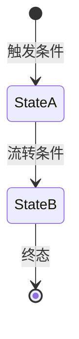
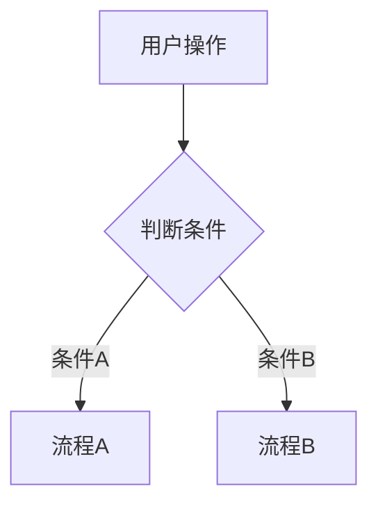

# [项目名称] PRD

> **📌 复杂度：** [简单/中等/复杂]　|　标注 `[中等/复杂]` 的章节简单需求可大幅精简

---

## 一、问题与目标

### 背景与痛点

> **💡 业务背景：** [用户遇到了什么问题？为什么现在必须解决？]

**现状痛点：** [具体描述当前问题，用 **加粗** 强调关键影响]

**业务价值：** [解决后带来的可量化收益]

### 目标与边界

> **📌 关键决策：** 本项目做什么/不做什么的边界划定

**核心目标：**

1. [目标1 — 用 **加粗** 标注核心指标]
2. [目标2]
3. [目标3]

**做：**

- [包含的功能/能力]

**不做：**

- [明确排除的内容及原因]

### 取舍声明 `[中等/复杂]`

> **⚖️ 取舍声明：** 以下为战略级取舍，解释"做什么/不做什么"背后的决策逻辑

| 取舍 | 选择 | 放弃 | 何时重新审视 |
|------|------|------|------------|
| [冲突的两个目标] | [选了什么] | [放弃了什么（具体）] | [什么信号触发重新评估] |

### 场景泛化 `[中等/复杂]`

**定位：** [定制功能 / 通用能力]

**扩展点预留：** [若为通用能力，说明未来可能的扩展方向及本期预留哪些插槽]

### 成功指标

> **✅ 验收重点：** 以下指标需可量化、可追踪

- [ ] **指标1：** [定义 + 目标值]，如 **新增通知类型零代码占比 ≥ 80%**
- [ ] **指标2：** [定义 + 目标值]
- [ ] *简单需求 1-2 个核心指标即可*

### 灵感碰撞记录 `[中等/复杂]`

> **⚡ 灵感来源：** 以下为灵感碰撞环节的产出记录

**纳入的灵感：**

| 灵感 | 价值 | 判定理由 |
|------|------|----------|
| [灵感描述] | [解决了什么基线方案解决不了的问题] | 纳入：[为什么值得做] |

**搁置的灵感：**

| 灵感 | 搁置原因 | 何时重新审视 |
|------|----------|------------|
| [灵感描述] | [有价值但代价/时机不确定] | [什么信号触发重新评估] |

---

## 二、架构与规则

### 核心业务对象

| 对象 | 定义 | 关键属性 |
|------|------|----------|
| [实体名] | [一句话定义它在业务中的角色] | [关键字段/特征] |

### 状态流转 `[中等/复杂]`

> [中等：文字描述状态及流转条件]
> [复杂：附 Mermaid 状态图]

*每个状态必须有明确的进入条件和退出机制。*

### 规则编排

> **💡 设计思路：** [为什么这样设计规则，核心逻辑是什么]

**核心规则：**

| 维度 | 说明 |
|------|------|
| 触发 | [什么事件触发] |
| 条件 | [满足什么条件] |
| 动作 | [执行什么操作] |

*（⚠️ 警惕硬编码枚举 — 审视是否应抽象为规则引擎配置）*

**边界场景：**

- [场景1] → [系统行为]
- [场景2] → [系统行为]

### 非功能约束

> **🔴 约束：** 以下为系统必须满足的底线要求

| 维度 | 要求 | 量化阈值 |
|------|------|----------|
| 性能 | [描述] | [如 P99 < 3s] |
| 容量 | [描述] | [如 10,000 条/分钟] |
| 可靠性 | [描述] | [如 至少1次重试] |
| 安全 | [描述] | [如 数据加密存储] |

---

## 三、执行契约

### 用户故事

**主路径：**

- As **[角色]** , I want **[行为]** , so that **[价值]**

**异常分支：**

- As **[角色]** , when **[异常场景]** , I expect **[系统反馈]**

### 界面交互 `[中等/复杂]`

> **📌 说明：** 描述用户关键操作流程及系统反馈，复杂需求附交互流程图

**黄金流程：**

1. [步骤1] → [系统响应]
2. [步骤2] → [系统响应]

**异常响应：**

- [异常场景] → [用户看到什么 / 系统如何处理]

### 全状态覆盖 `[中等/复杂]`

> **📌 说明：** 对每个用户可触发的操作，确认五态覆盖

| 操作 | 正常态 | 等待态 | 空态 | 错误区 | 边界区 |
|------|--------|--------|------|--------|--------|
| [操作1] | [预期响应] | [加载中看到什么] | [无数据看到什么] | [失败看到什么+下一步] | [极端情况处理] |

### 验收标准

> **✅ 验收：** 以下标准必须客观、可度量，禁用主观词（"体验好""快速""方便"）

- [ ] [验收项1：可客观判定的行为描述]
- [ ] [验收项2：包含可量化阈值]
- [ ] [验收项3：覆盖边界场景]

### 关键测试场景

| 场景 | 前置条件 | 预期结果 | 优先级 |
|------|----------|----------|--------|
| [主路径] | [条件] | [预期] | `[P0]` |
| [异常分支1] | [条件] | [预期] | `[P1]` |
| [边界场景] | [条件] | [预期] | `[P1]` |

### 埋点与观测 `[中等/复杂]`

| 指标 | 采集点 | 关联成功指标 |
|------|--------|--------------|
| [指标名] | [在哪里采集] | [对应第一节哪个指标] |

---

## 四、代价评估

> **📌 说明：** 以下为评估模板，由研发团队在技术评审后填写。PRD 阶段保留结构即可。

### 需求复杂度

[简单/中等/复杂] — *由产品经理根据门禁初判填写*

### 架构抽象收益

[描述长期复用价值，供研发评估参考] — *产品视角的收益说明，技术评估由研发补充*

### 开发周期预估

> **⚠️ 风险提示：** 以下由研发拆解填写，产品侧仅提供模块清单供参考

| 模块 | 预估人天 | 关键风险 | 备注 |
|------|----------|----------|------|
| [待研发拆解] | — | — | — |
| **合计** | — | — | — |

---

## 五、PRD 品质审查

> **📌 说明：** 输出前的保真度检查，确保设计品质完整传递到文档

### 审查自检

- [ ] **保真度**：门禁和打磨中的设计决策已全部写入 PRD，无遗漏
- [ ] **一致性**：同类场景处理方式一致，术语统一，详略一致
- [ ] **克制**：验收标准聚焦核心项，信息层级清晰
- [ ] **可读性**：研发可直接开工，无需二次追问
