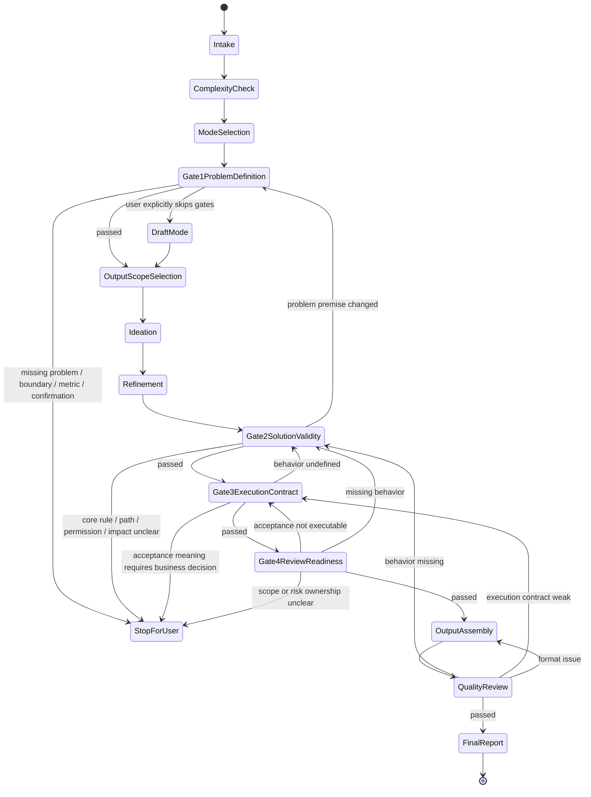

# Flow

本文件定义 `pm-solution-design` 2.x 的执行状态机。执行者必须按状态推进，不得跳过门禁，不得用默认假设替代用户确认。

## 核心规则

1. 每个状态必须满足准入标准后才能进入。
2. 每个门禁必须满足准出标准后才能进入下一状态。
3. 发现前置假设错误时，必须回退到对应门禁。
4. 用户可裁剪输出篇幅，不能裁剪产品判断底线。
5. 快速草稿必须标注未完成门禁，不得声明最终 PRD。
6. PRD 只定义产品行为契约，不写 API、数据模型、伪代码、具体人天。

## 流程总览

```text
需求输入
→ S0 Intake
→ S1 Complexity Check
→ S2 Mode Selection
→ G1 Problem Definition
→ S3 Output Scope Selection
→ S4 Ideation
→ S5 Refinement
→ G2 Solution Validity
→ G3 Execution Contract
→ G4 Review Readiness
→ S6 Output Assembly
→ S7 Quality Review
→ S8 Final Report
```



## S0 Intake

准入：用户提出 PRD、需求文档、产品方案、功能规划、需求澄清、灵感碰撞或取舍请求。

动作：声明使用 `pm-solution-design`，复述输入，判断是否适用。

准出：确认任务属于产品方案设计。

失败处理：纯实现、bug 修复、接口设计、数据库设计或排期估算不进入本流程。

## S1 Complexity Check

准入：S0 已确认适用。

动作：判定简单 / 中等 / 复杂，并说明依据。

准出：明确复杂度和后续加载深度。

失败处理：信息不足时按较高风险判定，但不得跳过 G1。

复杂度标准：

- 简单：单一角色、单一流程、少量状态、无复杂规则。
- 中等：多流程、有条件分支、有状态或权限。
- 复杂：多角色、多实体、多状态机、多维业务规则或可演进抽象空间。

## S2 Mode Selection

准入：完成复杂度判定。

动作：判定完整 PRD / 方案 Brief / 快速草稿。

准出：明确输出模式。

失败处理：用户未指定时默认完整 PRD；早期讨论可建议方案 Brief；用户明确跳过问题时进入快速草稿。

## G1 Problem Definition

目标：确认为什么做、做什么、不做什么、成功如何判断。

准入：完成复杂度和输出模式判定。

动作：确认业务背景、用户痛点、目标用户、做 / 不做边界、成功指标和用户确认。

准出：一句话问题定义成立；目标用户明确；边界明确；至少一个成功指标可判断；用户确认，或快速草稿标注未确认。

失败处理：缺问题、边界、成功指标或用户确认时必须停；用户给的是方案不是问题时追问为什么；需求本质变化时停在 G1 重对齐。

## S3 Output Scope Selection

目标：让用户决定本次输出包含 / 不包含什么，同时保住有效 PRD 底线。

准入：G1 已通过，或当前是快速草稿。

动作：按输出模式给出默认内容范围，询问用户是否包含或排除增强模块，应用不可省略底线。

准出：明确本次输出包含模块、裁剪模块和裁剪风险。

失败处理：用户要求删除底线模块时，拒绝完全删除，改为摘要或标注待确认；需求存在异常路径时，不允许完全删除异常响应。

## S4 Ideation

准入：G1 已通过，且输出模式不是极简草稿，或用户愿意展开。

动作：邀请用户提出 1 到 3 个灵感；做价值、代价、简化检验；判定纳入、搁置或淘汰。

准出：灵感处理结果明确，纳入项进入后续方案，搁置项有重新审视条件。

失败处理：用户跳过时记录“未输入灵感”，继续流程。

## S5 Refinement

准入：已有初步方案方向。

动作：审视状态覆盖、一致性和克制程度。

准出：形成可进入 G2 的方案草案。

失败处理：影响目标或边界时回退 G1；只是补状态、异常或一致性时自行修订。

## G2 Solution Validity

目标：判断方案是否站得住，系统行为是否闭合。

准入：G1 已通过或草稿状态明确；已完成输出范围确认；已识别核心场景和核心用户动作。

动作：定义核心业务对象；梳理核心流程；梳理关键状态及进入 / 退出条件；按 `practices/state-coverage.md` 检查五态覆盖（正常态、等待态、空态、错误态、边界态）和边界品类（显示边界、数据边界、状态边界、权限边界、兼容边界）；进行业务规则设计；检查异常流程和用户可见响应；做场景泛化判断；检查权限、角色、不可逆操作和异步任务边界。

准出：核心流程有起点、关键步骤和终点；关键状态有进入条件、退出条件和失败路径；核心操作已覆盖正常态、等待态、空态、错误态、边界态；显示边界、数据边界、状态边界、权限边界、兼容边界已按复杂度检查；业务规则有触发、条件、动作；主要异常流程有用户可见响应；场景泛化结论明确；未越界到 API、数据模型或伪代码。

失败处理：普通五态缺口自行补；业务规则、权限边界、用户影响或核心流程无法判断时停问用户；问题定义不成立时回退 G1。

## G3 Execution Contract

目标：判断研发、测试、设计是否能据此开工。

准入：G2 已通过；核心流程、状态、规则、异常响应已定义；输出范围已确定。

动作：检查用户故事、界面交互、验收标准、关键测试场景、埋点与观测需求、`practices/execution-baseline.md` 的执行基线和技术越界。

准出：用户故事覆盖主路径和关键异常分支；界面交互覆盖正常流程、异常流程和用户可见响应，若用户裁剪则保留摘要；异步操作定义等待态；不可逆操作定义确认机制；错误响应包含用户可执行下一步；空态有业务语义；重复操作有处理规则；验收标准客观可测无主观词；关键测试场景包含 P0 主路径、P1 异常、P1/P2 边界；中等/复杂需求说明关键观测指标或不做理由；未输出 API、数据模型、伪代码、具体人天。

失败处理：主观词、格式或优先级缺失时自行修；验收口径依赖业务定义时停问用户；系统行为未定义时回退 G2。

## G4 Review Readiness

目标：判断输出是否能被评审、交接、继续推进。

准入：G3 已通过；输出模式已知；未确认项已记录。

动作：检查输出模式、门禁状态、模块影响范围、风险和待确认项、代价评估框架、品质审查准备状态。

准出：输出模式清楚；门禁状态清楚；模块影响范围已列出；风险和未确认项已列出；代价评估只提供框架不填具体人天；品质审查准备就绪。

失败处理：缺模块清单、风险或模式标注时自行补；范围边界或重大风险归属不清时停问用户；验收不可执行时回退 G3；行为遗漏时回退 G2。

## S6 Output Assembly

准入：G4 已通过，或快速草稿明确标注未完成门禁。

动作：按完整 PRD、方案 Brief 或快速草稿组装输出；按输出范围包含或摘要模块；保留未确认项。

准出：输出结构与模式一致，没有把草稿伪装成最终 PRD。

失败处理：结构不一致时自行修订。

## S7 Quality Review

准入：已完成输出组装。

动作：检查保真度、一致性、克制、可读性、占位符、术语、主观词、优先级和技术越界。

准出：没有未标注占位符；术语一致；验收标准无主观词；关键测试场景有优先级；输出忠实反映门禁结论。

失败处理：格式问题回 S6；执行契约问题回 G3；行为遗漏回 G2；问题定义错误回 G1。

## S8 Final Report

准入：品质审查完成，或快速草稿已声明跳过项。

动作：报告使用的 skill、复杂度、输出模式、加载的 reference、四个门禁状态、未确认项和输出前检查结果。

准出：用户清楚知道这份输出是最终 PRD、方案 Brief，还是未完成门禁的草稿。
